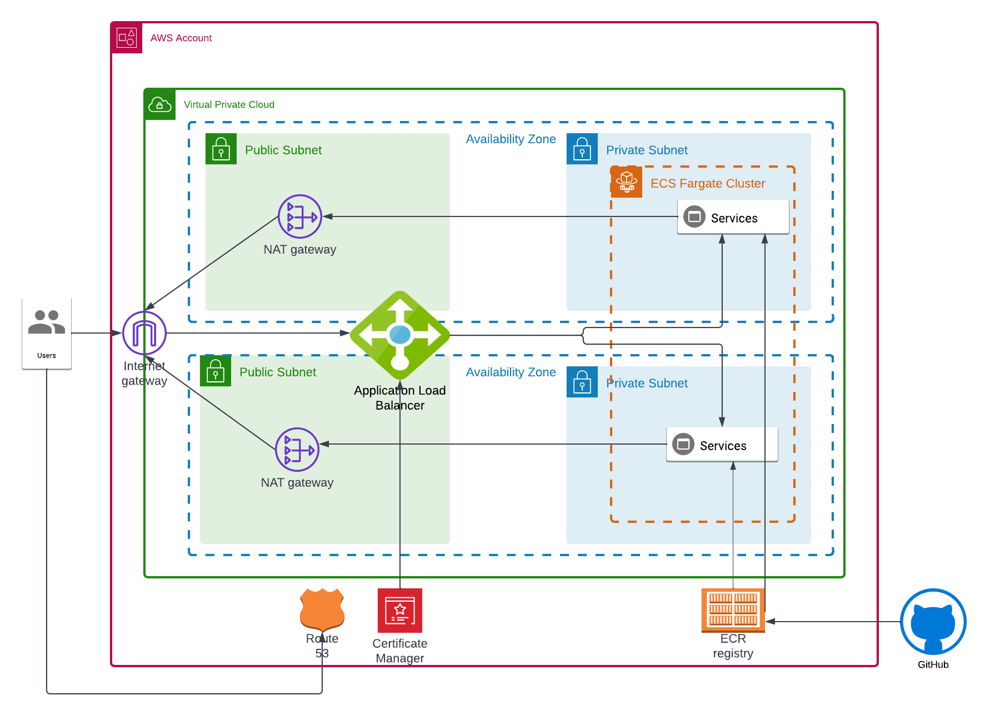

# Infrastructure



The infrastructure is defined in Terraform code found in the
[infrastructure](infrastructure) directory.
> Additional Terraform modules referenced can be found in the
[terraform-modules repo](https://github.com/bananalab/terraform-modules)

### Infrastructure Deployment
Before the first deployment the Terraform backend must be deployed:

```bash
cd infrastructure/aws/backend
terraform init
terraform plan -out tfplan.out
terraform apply tfplan.out
```

The infrastructure can be deployed with these commands

```bash
cd infrastructure/aws
terraform init
terraform plan -out tfplan.out
```

Carefully review the plan output before proceeding to

```bash
terraform apply tfplan.out
```
